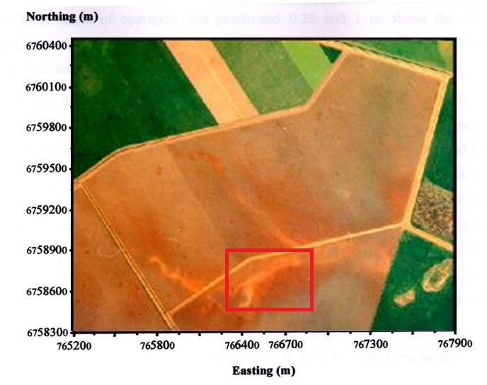

```{r setup, include=FALSE}
knitr::opts_chunk$set(echo = FALSE)
library(knitr)
library(tidyverse)
```

## The example Palaeo channel dataset

This data set is provided to be used as an example data set for the course. 
[reference](http://www.publish.csiro.au/sr/sr05037)

* Palaeochannels are remnants of ancient creeks or rivers in the alluvial landscape
* There are many in Northern NSW
* They are characterised by significantly sandier sediments in the clay landscape.

```{r PalaeoPic}

```


## Description of the data set

The data consists of:  
- A range of different Electromagnetic Induction measurements taken at 10 m increments on a 370 m transect
- Soil sample data at 6 locations along the transect, drilled to 13 m depth and sampled at 1 m increments
- Bullet 3

## Slide with R Output

```{r cars, echo = TRUE}
summary(cars)
```

## Slide with Plot

```{r pressure}
plot(pressure)
```

