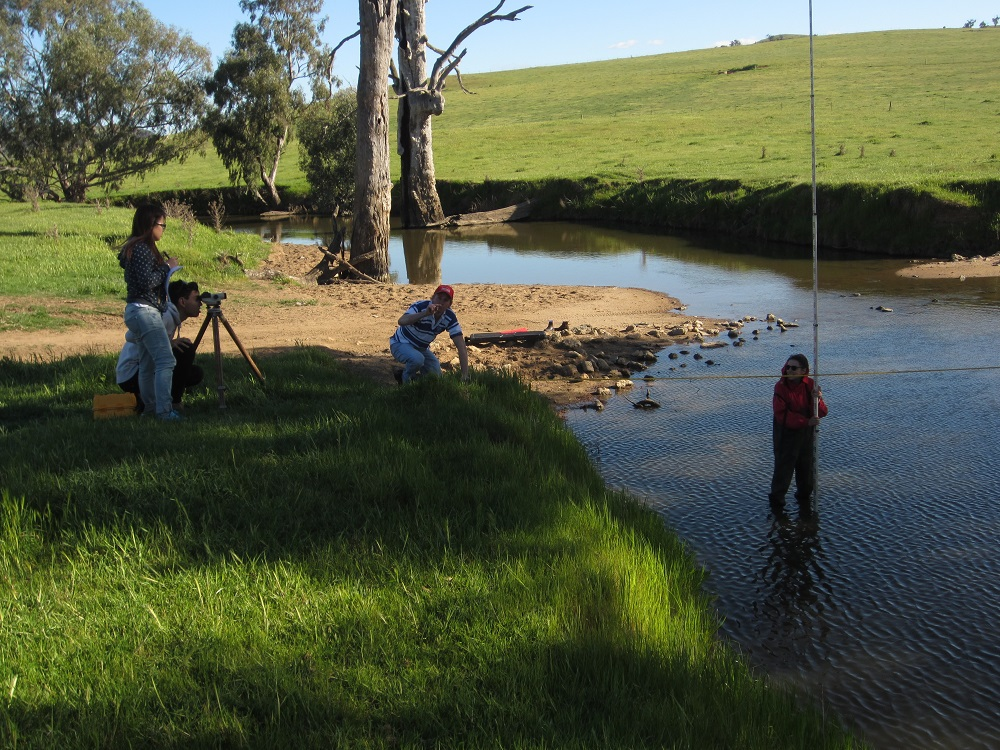
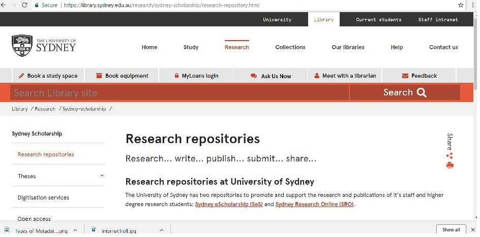
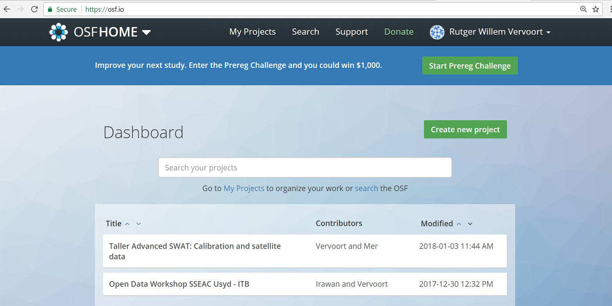

```{r setup, include=FALSE}
knitr::opts_chunk$set(echo = FALSE)
library(knitr)
library(tidyverse)
```

## Open data and reproducible research

Summary  

* Data and **open** data  
* The issue with verifiable research  
* Open and reproducible research  
* Challenges

## Data and **open** data (1)

How many of you have?

* Data from old research on a floppy disk, zip disk, usb stick, mobile harddrive: *I am going to publish that one day!*.
* Data on your harddrive from your PhD student, but you have no idea how she/he organised it
* received data from a colleague and spend hours reformatting it to your needs  
* asked data from a colleague, who said yes, but then could not find the data
* spend hours filling in forms and e-mailing with another institution to access data (climatology!!)


## Data and **open** data (2)

Have you ever experienced any of the following?

I have got this great idea,  

* but I cannot access the data  
* but I can't find a simple example of how to do the analysis correctly  
* but my model won't run without this specific data

or....I read this great paper,

* but I think the analysis is wrong.  
* but I can't work out how exactly they this analysis  
* but I think I know how to take the next step if I could use the data  

## Data and **open** data (3)

or...I am using this piece of software,

* but I don't understand how the algorithm exactly works
* but I would like to change it slightly to work better for my research
* but I can't access the code without a hefty fee

## Data and **open** data (4)

* Data can be anything, it can be words, numbers, pictures, even bits of code or algorithms  
* Most data is currently difficult to access
    + individuals computers
    + protected
    + not well described
* **Open data** is not only easily accessible, but is also well described
    + it has all the meta data to describe the *provenance* and the *characteristics*
* Examples are data from the IPCC and NOAA
* We will look at this in more detail later

## Meta data

\begin{columns}[t]
\begin{column}{0.4\textwidth}
  \includegraphics[width=1\textwidth]{images/Windowsfilemetadata.jpg}
\end{column}
\begin{column}{0.6\textwidth}
  \includegraphics[width=1\textwidth]{images/Types-of-Metadata_03.png}
\end{column}
\end{columns}

## Vocabulary and data dictionary

* The keywords for your metadata should originate from a **vocabulary** or an **ontology** 

    + Ontology: set of controlled terms for keywords with a hierarchy: example [\textcolor{blue}{FOR codes}](http://www.abs.gov.au/ausstats/abs@.nsf/0/6BB427AB9696C225CA2574180004463E)
    + A good ontology would have related terms, Wikipedia is an example of a system that uses an ontology
    + A vocabulary is a more simple list of keywords, for example, most journals require you to choose from specific keywords when you submit a paper

## Vocabulary and data dictionary

* Data dictionary is simpler:  
    + decribes columns in a data sheet
    + describes layout of code structure
    + describes files and folders
* example data dictionary: [\textcolor{blue}{Readme file in example project}](https://drive.google.com/open?id=1h9jI_ez6YecU-m20wb-ji-NgzrRPkzel)


## The issue with verifiable research

* The current process is peer review  
* Requires knowledgeable reviewers  
* System has been questioned recently, can it be fair and can it be maintained?  
    + Fairness to different languages (non English)  
    + Cost of traditional publishing
    + Hidden cost of reviewer's labour  
* open and reproducible research might be a solution  

\begin{columns}[t]
\begin{column}{0.5\textwidth}
  \includegraphics[width=1\textwidth]{images/NaturePeerreview.jpg}
\end{column}
\begin{column}{0.5\textwidth}
  \includegraphics[width=1\textwidth]{images/NatureReproducibility.jpg}
\end{column}
\end{columns}


## An ideal description of open, reproducible, peer reviewed research  

What would ideal open, reproducible research look like?

* all data and analyses should be open and accessible
* EGU journals?

```{r Diagram}
plot(1:225, 1:225, axes=F, col= "white", xlab="",
     ylab="", frame.plot=F)
points(30,175, pch = 21, bg = "white", col= "green", lwd=3, cex=12)
points(175,175, pch = 22, cex = 12, bg = "white", col = "lightblue", lwd=2)
points(120,210, pch = 22, cex = 12, bg = "white", col = "lightblue", lwd=2)
points(120,140, pch = 22, cex = 12, bg = "white", col = "lightblue", lwd=2)
text(30,175, labels = "author",cex=1.5)
text(75,210, labels = "publishes on server",cex=1.5)
text(175,175,"draft paper", pos = 3, offset = -1, cex=1.5)
text(120,210,"data", pos = 3, offset = 0, cex=1.5)
text(120,140,"workflow", pos = 3, offset = 0, cex=1.5)
arrows(c(52,52),c(175,175),c(105,105),c(150,200), length=0.2, lwd=2)
arrows(130,175,155,175, length=0.15, lwd=3)
points(c(145,170,200),c(70,70,70), pch = 21, bg = "white", col= "red", 
       lwd=2, cex=5)
text(170,70, labels = "public reviewers", pos = 1, offset = 1.5, cex=1.5)
text(185,70,"...",cex=2,font=2)
arrows(c(140,170,195),rep(95,3),c(120,135,175),c(115,185,140),
       length=0.10, lwd=3, lty=2, col="gray50")
arrows(125,70,45,165, length=0.15, lwd=3, col="gray50")
text(80,160, labels = "review", pos = 1, offset = 1, cex=1.5)
points(75,50, pch = 22, cex = 12, bg = "white", col = "darkblue", lwd=2)
text(40,100,"Author reply", cex=1.5)
text(75,50,"revised", pos = 3, offset = 1)
text(75,50,"paper", pos = 3, offset = -1)
arrows(30,145,55,50, length=0.15, lwd=2)
text(90,15,"Paper, author reply and", cex=1.5)
text(90,0,"reviews published", cex=1.5)
#arrows(80,60,80,30, length=0.10, lwd=2)
arrows(120,105,100,30, length=0.2, lwd=3, lty=2, col= "gray50")

```

## The roadblocks to open data and reproducible research

Why is this not happening?

* Skill and ability to publish open data and workflows (researcher)  
    + meta data
    + workflow documentation  
* Provision of infrastructure (institution)  
* IP and ownership claiming  
* unbiased reviews and internet trolls  


## Three major components to reproducible data and research

* Open and accessible data
* For *raw* data: fully documented metadata (what the data actually is, and how it was generated or measured)
* For *derived* data: fully described and documented workflow (*provenance*, how the data was manipulated)

```{r fieldphoto, out.width="50%"}

```

## New skills that we need to make it happen

* How do we regularly and consistently describe metadata with our data  
* How do we easily publish data and preprints (How does our institution manage this)  
* Understanding how we can protect IP: licencing and digital identifiers
* Getting recognition and support from our institutions for open data publications

```{r USYDrepos, out.width="50%"}

```

## How this workshop fits in

Over the next 4 days, we will teach you about:

* data, and how to write good metadata 
* netcdf and why this might be useful
* workflows and how to record a workflow using Rmarkdown
* code and how to manage code via github
* how to get recognition, DOI and licences

## What is already out there?

There is already a lot out there! (althought not everything is free)

* Data journals, for example [Data in Brief](https://www.journals.elsevier.com/data-in-brief) and [Data](http://www.mdpi.com/journal/data), and there is a growing list
* Data repositories, for example [PANGAEA](https://www.pangaea.de/), but here is [a long list](https://www.re3data.org/browse/by-subject/)
    + The University of Sydney also runs its [own data repository](https://ses.library.usyd.edu.au/)
* Journals to publish workflows, for example [MethodsX](https://www.journals.elsevier.com/methodsx)
* Full open science repositories, such as [Zenodo](https://zenodo.org/) and [OSF](https://www.osf.io/)

```{r OSF, out.width="50%"}

```

## Class activity (15 minutes)

* Discuss in groups: 
    + How you have shared data in the past?
    + What are the main ways how you currently store and *curate* data. How easy would it be for someone else to access your data?
    + What actions do you have to take to share data.
    + How easily have you accessed someone else's data?

* As a group report back to summarise