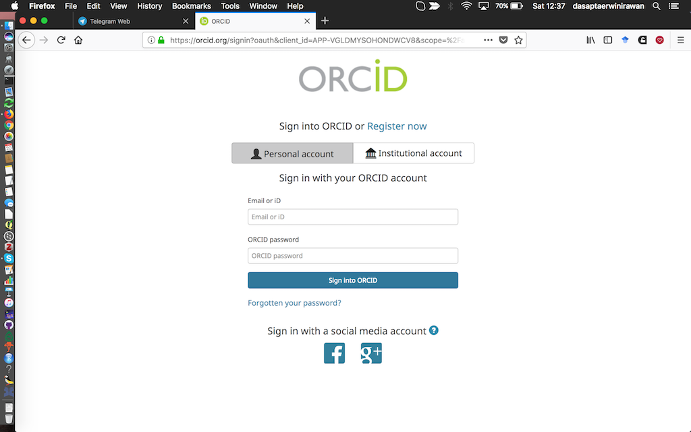
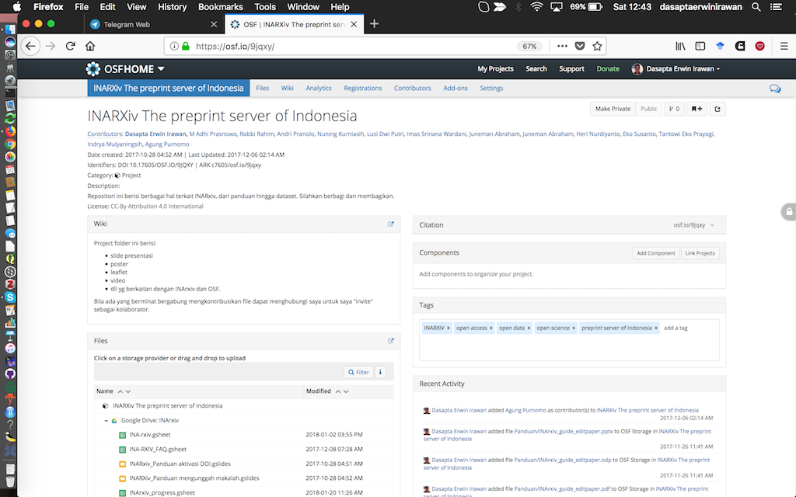
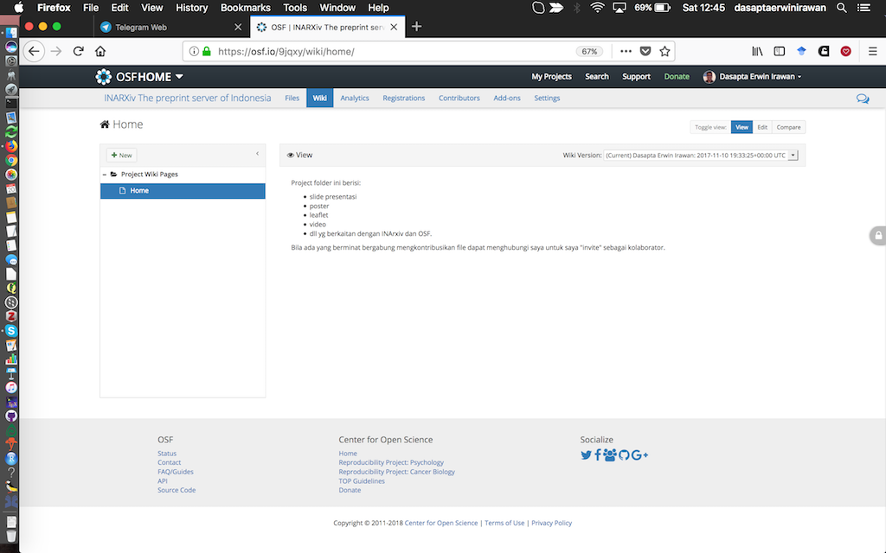
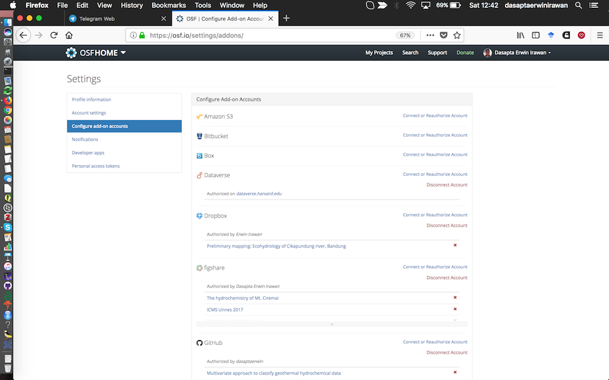
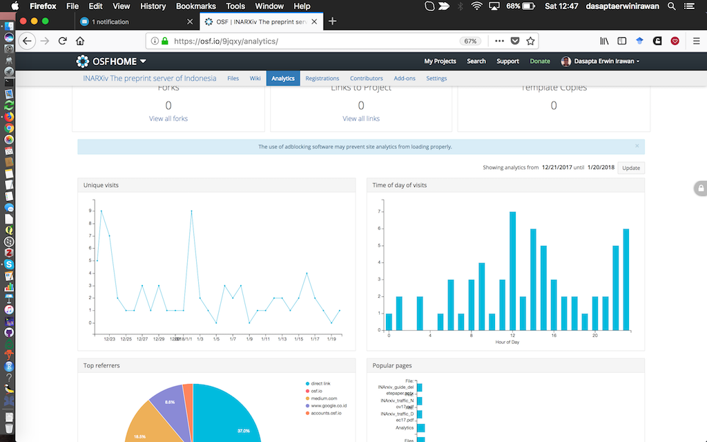

## Let's recap

So far, you have learned about:

1. open data
2. research data management

## In this session you will learn about

- Git and GitHub repository,
- What it does and how it can help you, 
- How to use it to:

    - host your documents 
    - collaborate 
    - maximize version control

## What is `Git`

## What is `GitHub`

## What is `version control`

## What are the components of a GitHub repository

- local repository (located in your hard drive)
- remote repository (located in your GitHub account)

## Basic command

## Setting up a new repository

## Repository page

## Project description (wiki)

- You can add description or a set of description in you project, in [Markdown](https://github.com/adam-p/markdown-here/wiki/Markdown-Cheatsheet#images).
- In fact, you could write the whole report directly in you project page.

## Project description (wiki) (2)

## Integrate other services (if you have one)

- If you maintain other service previously, you can add it to your project repository.
- You can choose which folder to correspond to your project.

## Integrate other services (if you have one) (2)

## Measuring visitors

- You can observe your visitors and how you can amplify your impact to the society.
- The sum of your visitor, what platform that drive them to visit, etc.

## Measuring visitors (2)

## Exercise

- setup your own project folder
- upload your data and add a description
- explore other participant's repository and fork

