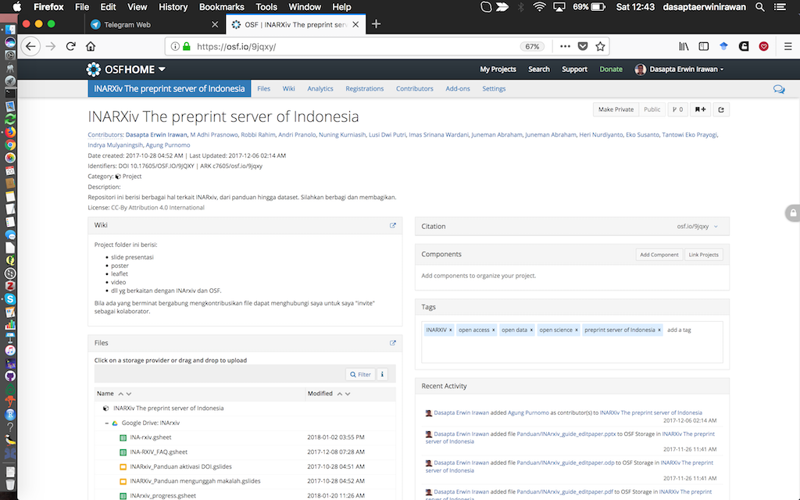
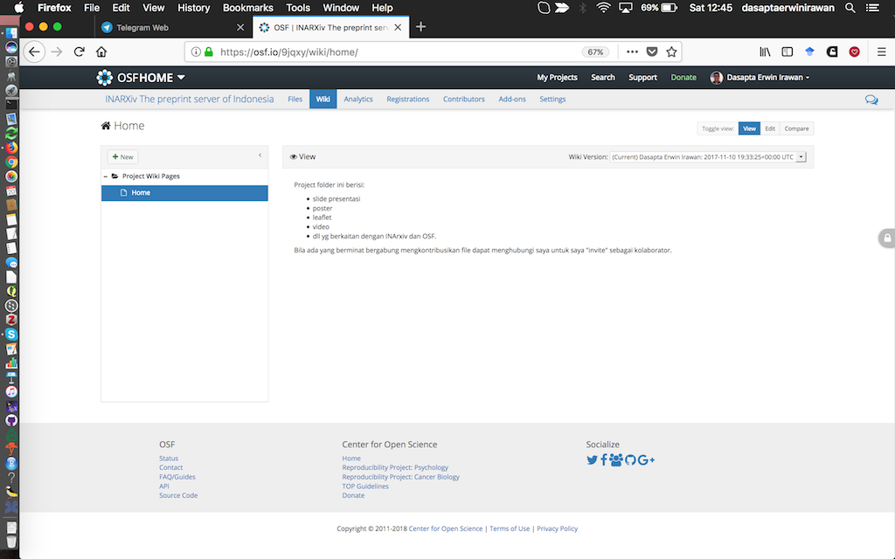
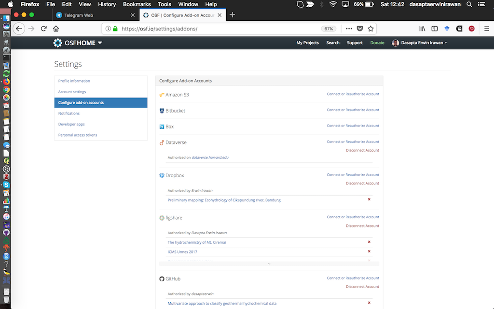

## Let's recap

So far, you have learned about:

1. open data
2. research data management
3. introduction to GitHub
4. setting up a data repository (netcdf)

## In this session you will learn about

- Data repository and 
- The OSF

## What is data repository

- Data repository is a warehouse for your data: a place where you can store your data safely
- With permanent/persistence link (or DOI)
- Accessible (depends on your authorization) and searchable by other (indexed by crawlers) 

## Example of data repository

Here are some examples of popular repositories:

- [GitHub](github.com) would be one example, especially for storing codes.
- [OSF](osf.io): a free open repository by [Center for Open Science](cos.io).
- [Zenodo](zenodo.org): a free open repository by [CERN](https://home.cern/).
- [Figshare](figshare.com): a freemium open repository by [Digital Science](https://www.digital-science.com). 
- [Dataverse Project](dataverse.org): a free open repository by Harvard University.
- [Pangaea](pangaea.de): a free open respository for earth and environmental science.
- and more of them that can be searched from [OpenDOAR database](www.opendoar.org/).

## Why OSF?

We choose the OSF because:

- it could be used in the whole research cycle.
- it has a very flexible project folder: easy to create, manage, and preserve.
- it offers persistence link.
- it integrates multiple online services.

## Landing page

## Signup page

You can signup using plain email, but if you maintain an ORCID, then you should use it. 

## Profil page

You should do this to amplify your profile.  

## Project page

Here's the list of your projects

## Creating project

- It's worth the time to complete all the box, because it creates the metadata of your project.
- You may choose to make it `public` or `private`.
- You also may set a DOI for your project and don't forget to choose a license. CC-BY ver 4 is highly recommended.

## Creating project (2)

## Repository page

## Project description (wiki)

- You can add description or a set of description in you project, in [Markdown](https://github.com/adam-p/markdown-here/wiki/Markdown-Cheatsheet#images).
- In fact, you could write the whole report directly in you project page.

## Project description (wiki) (2)

## Integrate other services (if you have one)

- If you maintain other service previously, you can add it to your project repository.
- You can choose which folder to correspond to your project.

## Integrate other services (if you have one) (2)

## Measuring visitors

- You can observe your visitors and how you can amplify your impact to the society.
- The sum of your visitor, what platform that drive them to visit, etc.

## Measuring visitors (2)

